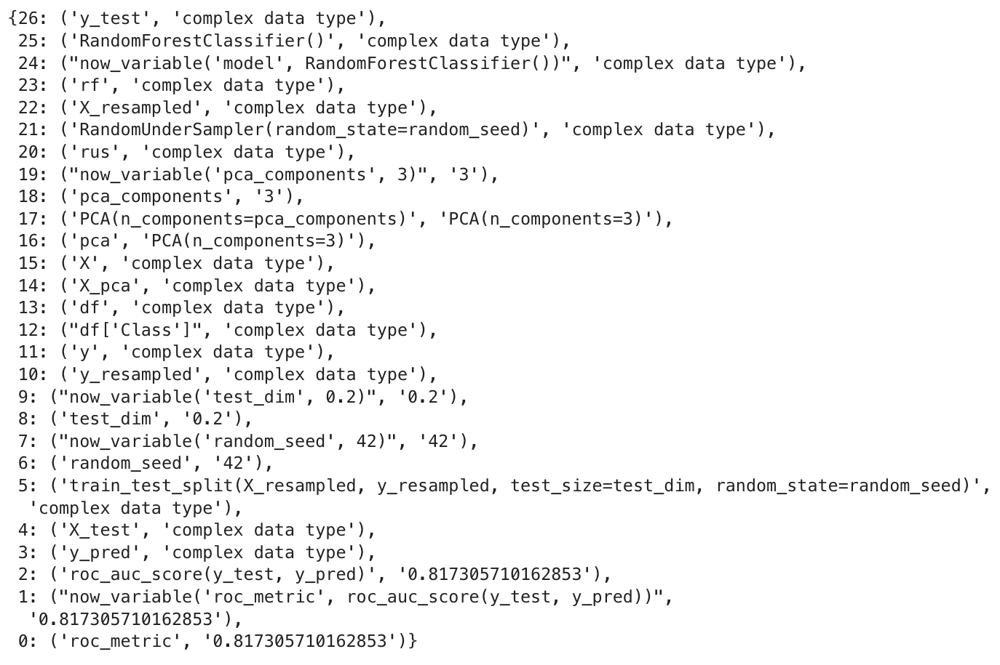
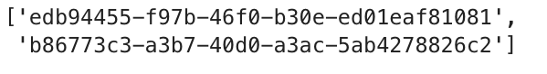
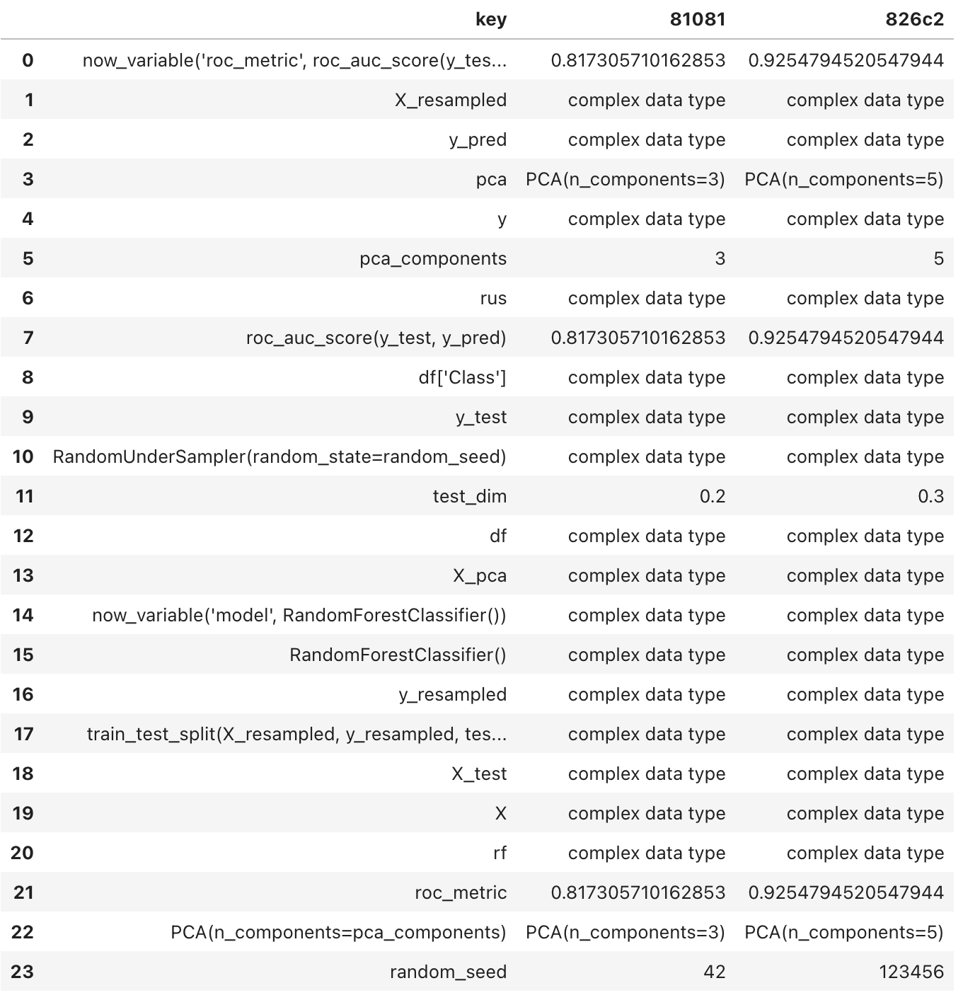
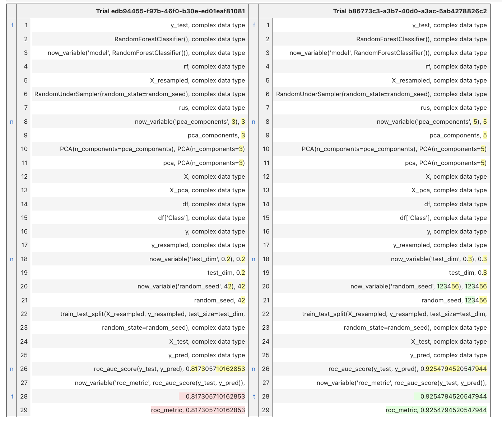
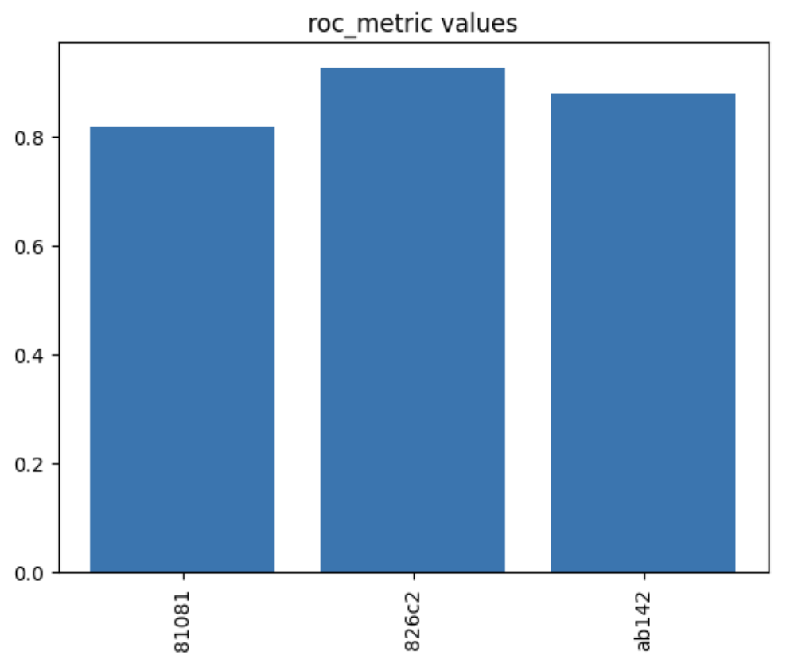
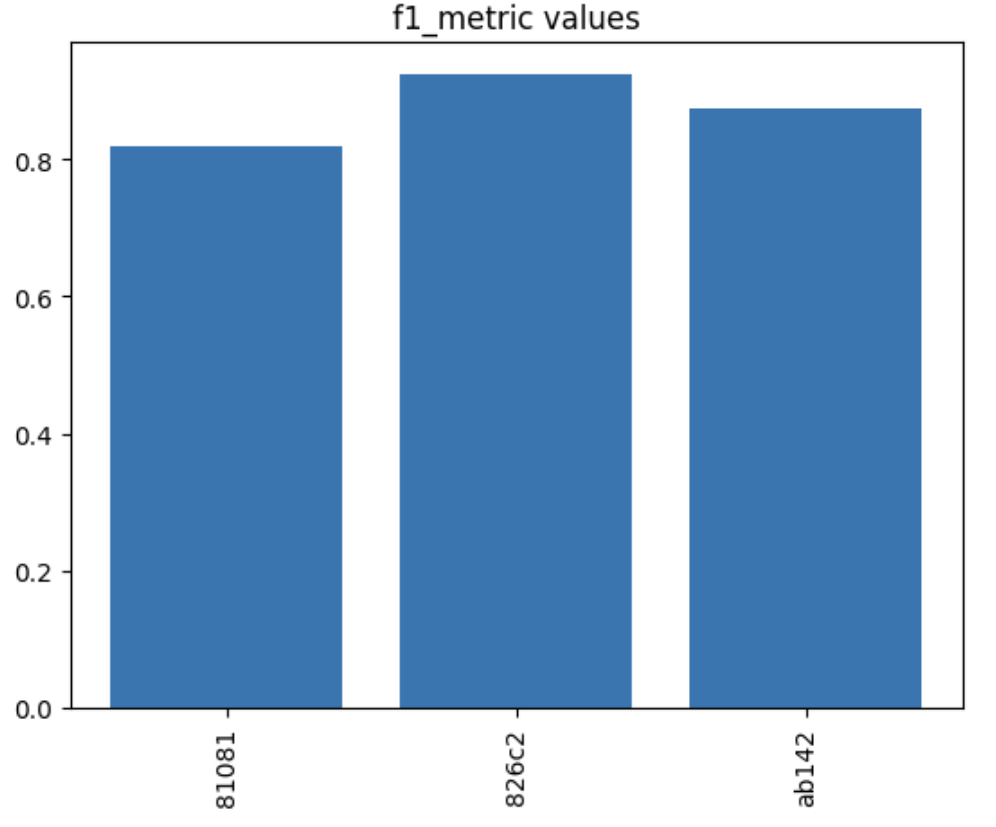
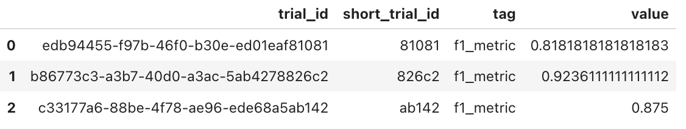
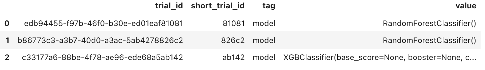

# Provenance of Machine Learning experiments with noWorkflow

In many academic and industrial teams involved in Data Science and Machine Learning, we frequently find ourselves starting experiments with minimal structure, basic setups, and a multitude of hypotheses. This initial stage is all about exploration, where our primary goal is to validate if our hypotheses hold.

However, as these experiments progress, they quickly grow in complexity, and managing them becomes challenging. Reproducing a specific trial with its unique setup becomes cumbersome, and handling multiple trials can seem nearly impossible.

In this blog post, we introduce you to the [noWorkflow](https://github.com/gems-uff/noworkflow) package, with exciting features born out of the [Summer of Reproducibility](https://ucsc-ospo.github.io/osre/) project in 2023. We'll demonstrate its capabilities with a practical use case, highlighting how it can streamline your workflow.


## Introducing the noWorkflow

According to the noWorkflow developers' team, the primary goal of noWorkflow is to _"...allow scientists to benefit from provenance data analysis even when they don't use a workflow system."_. Unlike other tools, _"noWorkflow captures provenance from Python scripts without needing a version control system or any other environment"_. It is particularly interesting when we are in the scenario described above, where we lack any structured system at the beginning of experiments. In fact, after going through the docs, we can verify that noWorkflow provides:

* Command-line accessibility
* Seamless integration with Jupyter Notebooks
* Minimal setup requirements in your environment
* Elimination of the need for virtual machines or containers in its setup
* Workflow-free operation
* Open source
* Framework agnostic

On top of that, in the OSPO Summer of Reproducibility Program, we added additional features to enhance DS/ML experiment reproducibility. In this regard, we introduced:

* The ability to tag variables of interest, allowing researchers to track all operations related to a specific variable's value
* A feature to display dependencies of tagged variables
* Tools for comparing the history of a tagged variable between two trials
* The option to retrieve the values of a tagged variable across all trials within an experiment
* *A bonus*: Achieving all of this with minimal intrusive code added to your notebook

To showcase how these features can take your experiment management to another level, we have chosen a classical problem in Fraud Detection as a Machine Learning application to test the noWorkflow.

## Noworkflow Setup

To perform this tutorial, we highly recommend setting up a Conda environment on your system, which involves installing the noWorkflow package and Jupyter Lab. To reproduce the experimental Notebooks, you can clone this repository as well. Take advantage of the [_requirements.txt_](requirements.txt) file to accelerate your setup with pip tools.

First, clone our use case tutorial to your local machine and create a separate environment:

```bash
git clone -b sor_pull_request https://github.com/jaglima/noworkflow.git

cd noworkflow
# Create a conda env
conda create -n noworkflow python=3.10
conda activate noworkflow
pip install -r ./Examples/usecase_credit_fraud/requirements.txt
```

Install the noWorkflow:
```bash
# install the noWorkflow
pip install -e capture[demo]
pip install jupyter==1.0.0
jupyter nbextension install --py --sys-prefix noworkflow
jupyter nbextension enable noworkflow --py --sys-prefix

# install noworkflow jupyter kernel
now kernel
cd ./Examples/usecase_credit_fraud
```

Download the dataset for our example from:
````
https://www.kaggle.com/mlg-ulb/creditcardfraud
````

and save it in the \dataset folder in this directory.

Finally, fire up the Jupyter Lab to start the fun.

```python
jupyter lab
```

In the noworkflow_usecase directory, you will find the dataset directory and five Notebooks. [Notebook 1](now_usecase_part_1.ipynb) and [Notebook 2](now_usecase_part_2.ipynb) represent two distinct trials of a Fraud Detection experiment we will go through next sessions. [Notebook 3](now_usecase_part_3.ipynb) wraps up a comparison between trials 1 and 2. [Notebook 4](now_usecase_part_4.ipynb) presents another trial using a different approach. [Notebook 5](now_usecase_part_5.ipynb) offers a comparison between trials 1 and 4.

## Fraud Detection use case

Fraud detection is a typical use case that encompasses classical challenges in ML projects. It often involves dealing with imbalanced datasets, requiring various feature transformations, and follows the usual steps of Machine Learning projects. Here we based this [work](https://link.springer.com/article/10.1186/s40537-023-00684-w) on making use of [Kaggle Credit Card Fraud Detection Dataset](https://www.kaggle.com/mlg-ulb/creditcardfraud), initially published by Worldline and the Universite Libre de Bruxelles (ULB).

To get started with this tutorial, you'll need to select the noWorkflow kernel in the Jupyter Notebooks you have at hand and then execute the following code:

```python
df = pd.read_csv('dataset/creditcard.csv', encoding='utf-8')
X = df.drop('Class', axis=1)
y = df['Class']

# Here we are stamping pca_components as a now_variable, and started 
# monitoring it
pca_components = now_variable('pca_components', 3)
pca = PCA(n_components=pca_components)
X_pca = pca.fit_transform(X)

# Same here with random_seed
random_seed = now_variable('random_seed', 42)
rus = RandomUnderSampler(random_state=random_seed)
X_resampled, y_resampled = rus.fit_resample(X_pca, y)

# Same with test_dim
test_dim = now_variable('test_dim', 0.2)
X_train, X_test, y_train, y_test = train_test_split(X_resampled, y_resampled, test_size=test_dim, random_state=random_seed)

# Keeping the model type 
rf = now_variable('model', RandomForestClassifier())
rf.fit(X_train, y_train)
y_pred = rf.predict(X_test)

# Finally, keeping the metrics roc and f1
roc_metric = now_variable('roc_metric', roc_auc_score(y_test, y_pred))
f1_metric = now_variable('f1_metric', f1_score(y_test, y_pred))

print("Random Forest - ROC = %f, F1 = %f" % (roc_metric, f1_metric))
```

After running this snippet, with our parameters rightly tagged, we have our first trial. Additional trials can be generated by changing hyperparameters, feature transformations, models and metrics at the choice of the researcher. 

## NoWorkflow at the spotlight

When calling the backward_deps('tagged_var_name'), 
we receive a list of variables that are involved in the computation of the tagged variable. In this example, if you call it with the 'roc_metric' tag, the output will include all operations that were involved in the construction of its final value. Let's check how it goes:


```python
dict_ops = backward_deps('roc_metric', False)
```


The output is in Python dictionary format, with all the operations in the order they were executed. At the end of the list, you will find the assignment operation where the 'roc_metric' variable is assigned the value of 0.81.

To preserve these outputs for future comparisons with additional trials, you can save them by invoking:

``` python
trial_id = __noworkflow__.trial_id
store_operations(trial_id, dict_ops)
```

The list of currently stored trials can be obtained using:

```python
resume_trials()
```


It is presented as a list, where the trial IDs can be referenced by their index.


## Experiment comparison

Suppose now that you've already executed a second trial with a different set of parameters. It is done in the use case notebook [here](now_usecase_part_2.ipynb)](now_usecase_part_2.ipynb) and we encourage the reader to rerun the previous snippets tweaking some of the hyperparameters to see the impact. By doing this, we can then compare the outcomes of both trials using the trial_intersection_diff() and trial_diff() functions. Let's explore these comparisons.

```python   
trial_intersection_diff(list_id[0], list_id[-1])
```


In the previous output, you may have noticed that 'pca_components' has been changed from 3 to 5, and the 'test_dim' size has increased from 0.2 to 0.3. However, please be aware that the vectors, matrices and complex types like 'y_test' and 'y_pred,' are not available for inspection. We acknowledge this limitation and it is on our backlog.

When running trial_diff(), the function displays the values of variables and function calls in a diff file format, emphasizing the sequence of operations performed. The purpose is to identify any discrepancies that occurred between the two trials. In the side columns, the letters f, n and t mean to (f)irst, (n)ext and (t)op. They are links that allow the user to navigate through the position of the differences detected.

``` python
trial_diff(list_id[0], list_id[-1])
```



In this case, we can easily spot the differences in the 'pca_components' and 'test_dim' provenance as well as differences in their results. 

## Tagged multi-trial plots

From a broader perspective, we implemented a multi-trials displaying feature, where we can easily inspect the values of tags across multiple trials. This feature is particularly useful when evaluating the behavior of control variables across various trials and serves as an initial step in facilitating cross-comparisons between features and results in multi-trial experiments.

In the current implementation of noWorkflow, any tagged variable can be inspected in a mult-trials plot, just by invoking:

```python
var_tag_plot('roc_metric')
```


In this instance, we can see that the best roc_metric was achieved in the experiment trial nicknamed 826c2. 

Similarly, we can examine the f1_metric, which confirms that the best performance was indeed achieved in trial 826c2.
```python
var_tag_plot('f1_metric')
```



## Multi trial outputs

Another feature is the general-purpose plot, that can be used to inspect any tagged variable. The user can also retrieve a pandas DataFrame containing the values, allowing them to create their plots or perform further analysis. In this case, the values are returned as in the example:

```python
var_tag_values('f1_metric')
```



```python
var_tag_values('model')
```




### Final words

In this brief tutorial, we have demonstrated how to use noWorkflow to enhance the management of experiments in DS and ML during their initial stages. These features are the foundation for exploring the advantages that noWorkflow offers as a provenance collection tool in the field of data analytics.

All the features described here have emerged from our research and experience, focusing on critical provenance issues that commonly arise during the early stages of experiments. We trust that the broader community will also find them valuable.

We would like to express our gratitude to the OSPO Summer of Reproducibility organization and the noWorkflow core team for providing us with this opportunity to contribute to the Open Source community. We invite readers to give noWorkflow a try and share their feedback and experiences. Together, we can take steps towards achieving greater reproducibility and innovation in our work.

Thank you for embarking on this journey with us.